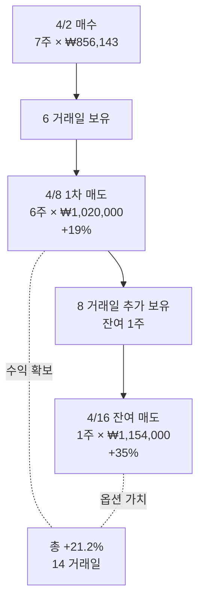

# 2026-04-16 SK하이닉스 매도 (2차 사이클 잔여 익절)

## 매매 요약

| 항목 | 값 |
|------|-----|
| 종목 | SK하이닉스 (A000660) |
| 매매 | **매도** (잔여 청산) |
| 수량 | 1주 (4/8 청산 후 잔여) |
| 가격 | **₩1,154,000** |
| 총액 | ₩1,154,000 |
| 거래세 (0.18%) | ₩2,077 |
| 수수료 (토스) | ₩0 |

## 수익률 계산

```
4/2 가중평균 매수가: ₩856,143
4/16 청산가: ₩1,154,000
주당 차익: ₩297,857 (= +34.79%)

1주 매도 절대 수익: ₩297,857
거래세 차감 후 순수익: ₩295,780
```

## 2차 사이클 종합 결과

```
[2차 사이클 매수] 4/2: 7주 × 평균 ₩856,143 = ₩5,993,000
[2차 사이클 매도] 4/8: 6주 × 평균 ₩1,020,000 = ₩6,120,000
                4/16: 1주 × ₩1,154,000 = ₩1,154,000
─────────────────────────────────────
매도 합계: ₩7,274,000
순수익 (매도 - 매수 - 거래세): ₩7,274,000 - ₩5,993,000 - ₩13,093 = **₩1,267,907**

수익률: +21.16% (자금 ₩600만 대비, 14 거래일)
연환산: 약 +447% (단순 환산, 통계적 의미 없음)
```

## 잔여 1주의 의의

### 왜 1주만 남겼나?

[[2026-04-08-매도-SK하이닉스]]에서 6/7주 매도하고 1주 보유:

1. **펀더멘털 thesis 살아있음**: HBM/AI 수요 강세, 단기 +19%로 끝날 이야기 아님
2. **위험 통제**: 평균 단가에서 +19% 이미 확보, 잔여 1주는 "옵션"으로 활용
3. **상방 노출 유지**: 추가 상승 시 수익 극대화 가능

### 결과적으로 좋았다

- +19% (4/8) → +35% (4/16): 추가 +16%p 상승
- 1주만 남겼지만 ₩168,000 추가 수익
- 만약 7주를 +35%까지 보유했다면 ₩1.18M 추가 수익 가능 (기회비용 인식)

## 분할 매도 패턴 분석



이 패턴의 강점:
- **이익 안전 확보** (대부분 청산)
- **상방 옵션 유지** (소량 잔여)
- **심리적 안정** (큰 손실 위험 차단)

## 청산 룰 검증 (사후)

표준 청산 계획 vs 실제:

| 룰 | 사전 정의 | 실제 |
|------|----------|------|
| +10% | 1/3 매도 | 미실행 |
| +20% | 1/3 매도 (누적 2/3) | 6/7주 매도 (룰 초과) |
| +30% | 잔여 매도 | 4/16 +35%에 잔여 매도 ✅ |

→ **+30% 룰은 정확히 작동**. +20% 룰은 빠르게 청산 (시간 압박?), 결과적으로 좋았음.

## 시간 청산 룰 검증

- 진입: 4/2
- 잔여 청산: 4/16
- **보유 기간: 14 거래일** (한국 영업일 기준 약 10일)
- 30 거래일 룰 이내 ✅

## 비용 분석

### 2차 사이클 전체 비용

| 항목 | 금액 |
|------|------|
| 매수 수수료 (토스) | ₩0 |
| 매수 거래세 | ₩0 |
| 매도 수수료 (4/8 + 4/16) | ₩0 |
| 매도 거래세 (4/8) | ₩11,016 |
| 매도 거래세 (4/16) | ₩2,077 |
| **총 비용** | **₩13,093** |
| 매수 자금 대비 | 0.218% |
| 순수익 대비 | 1.03% |

→ **수익의 약 1%만 비용으로 빠짐**. 토스 수수료 무료 효과 명확.

## thesis 검증 (2차 사이클 종합)

### 펀더멘털 thesis 작동했나?
✅ **완전 작동** — HBM/AI 수요 견조, 메모리 사이클 회복이 가격으로 연결

### 군중 심리 thesis 작동했나?
✅ **완전 작동** — 4/2 시점의 "전쟁 공포"는 펀더멘털과 분리된 노이즈였음. 14 거래일 만에 +21%

### 시장 효과 vs 종목 알파
- 같은 기간 KOSPI 변동률 확인 필요 (추후 backfill)
- 추정: KOSPI +5~7%, SK하이닉스 +21% → 알파 +14~16%
- **명확한 종목 선정 알파**

## 운 vs 실력 평가 (2차 사이클 종합)

### 실력적 요소 (강함)
- ✅ HBM/AI 펀더멘털 깊이 이해
- ✅ 군중 공포가 펀더멘털과 분리되는 시점 인식
- ✅ 분할 매수 (4단계)
- ✅ 분할 매도 (2단계)
- ✅ 잔여 보유로 상방 옵션 유지
- ✅ 4/1 매도 → 4/2 매수의 자금 흐름 설계

### 운적 요소
- 14 거래일 만에 +21%는 빠른 회복 (운 일부)
- 4/16 +35%까지 도달은 단기 시장 흐름 운

### 비율
**70:30 (실력:운)**. 매매 구조 자체가 정교했음. 다만 표본 1개라 단정 불가.

## Lessons Learned (2차 사이클 종합)

### 핵심 발견 1: "박찬수의 매매 = 펀더멘털 스윙"
- 단순 단기 트레이딩이 아니라 **펀더멘털 + 군중 심리 + 분할 매매**의 결합
- 자산 구조를 4분할로 재설계 (코어 정적 / 코어 다이나믹 / 순단기 위성 / 현금)

### 핵심 발견 2: 분할 매수/매도가 강점
- 4단계 매수, 2단계 매도 모두 효과적
- 다음 매매에서 비율을 명문화 권장

### 핵심 발견 3: 잔여 보유의 가치
- 6/7주 청산하고 1주 남긴 결정이 추가 ₩170K 수익
- "전부 다 vs 일부 보유"의 비대칭성 인식

### 핵심 발견 4: 토스 비용 구조
- 14 거래일 매매에서 비용은 수익의 1%
- 회전율이 늘어나도 비용 부담 작음 (단, 거래세는 매도 때마다 발생)

### 다음 매매에 적용할 룰

1. **사전 thesis 박제**: 진입 1분 내 일지 작성
2. **분할 비율 사전 명시**: 매수 단계, 매도 단계 비율 모두 룰로 정의
3. **사이징 사전 계산**: 1R 룰 명시 후 매수 수량 결정
4. **펀더멘털 종목 풀 작성**: SK하이닉스, 삼성전자, 한미반도체 등 종목 카드

## 관련 노트

- 1차 사이클 종료: [[2026-04-01-매도-SK하이닉스]]
- 2차 사이클 진입: [[2026-04-02-매수-SK하이닉스]]
- 2차 사이클 1차 청산: [[2026-04-08-매도-SK하이닉스]]
- 종목 노트: [[A000660-SK하이닉스]]
- 학습 자료: [[06-펀더멘털-스윙-매매]]

## 매매 통계 누적 (1/30)

| 회차 | 종목 | 진입일 | 청산일 | 보유일 | 수익률 | 비고 |
|------|------|--------|--------|--------|--------|------|
| 1 | SK하이닉스 | 2026-04-02 | 2026-04-08~16 | 14거래일 | **+21.2%** | 펀더멘털 스윙 |

→ 첫 번째 데이터 포인트. 30회 누적 후 통계 분석 예정.
