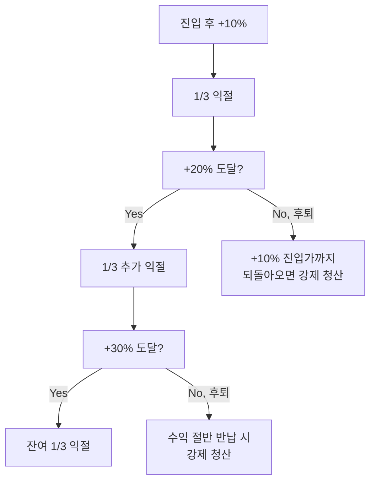

# 공포에 사서 환희에 판다 — 개요

## 5줄 요약

1. "공포에 사서 환희에 판다"는 워런 버핏의 *"Be fearful when others are greedy, and greedy when others are fearful"*에서 비롯된 컨트래리언 원칙이다.
2. **군중과 반대로 가는 것이 통하는 이유는** 시장이 단기적으로는 감정에 의해 움직이고, 감정은 극단에서 평균회귀하기 때문이다.
3. 다만 "공포"의 정의가 모호하면 단순한 평균회귀 트레이딩이 되거나, 떨어지는 칼날을 잡는 결과가 된다.
4. 진짜 시스템적 공포(VIX 40+, Fear & Greed 10↓)는 1~2년에 한 번 오므로, **인내심**이 핵심 자원이다.
5. 환희 시점은 정의가 더 어렵다. 따라서 **분할 익절**과 **시간 기반 강제 청산**이 필요하다.

---

## 1. 왜 컨트래리언이 통하는가 — 심리학적 근거

### 시장의 두 얼굴: 효율과 비효율

전통 금융이론(EMH, 효율적 시장 가설)은 **모든 정보가 가격에 즉시 반영된다**고 가정한다. 이 가정 하에서는 컨트래리언 전략이 작동할 수 없다. 왜냐하면 "지금 공포에 빠진 가격"이 곧 "현재 정보가 반영된 적정 가격"이기 때문이다.

그러나 행동경제학(Daniel Kahneman, Richard Thaler 등)이 밝힌 바로는, 인간은 다음과 같은 체계적 편향을 가진다:

- **손실 회피 (Loss aversion)**: 같은 크기의 이익보다 손실을 2배 더 크게 느낀다 → 공포 국면에서 비합리적 매도 발생
- **군중 심리 (Herding)**: 다수의 행동을 따라가는 것이 안전하다는 본능 → 매도가 매도를 부르는 캐스케이드
- **최근성 편향 (Recency bias)**: 최근 일어난 일이 앞으로도 계속될 것이라 믿음 → 하락이 시작되면 "더 떨어질 것"이라 믿어 매도 가속
- **앵커링 (Anchoring)**: 최근 고점을 기준으로 판단 → "30% 빠졌으니 비싼 게 아니다"라는 잘못된 안심

이 편향들이 동시에 발동하는 순간이 **시장 패닉**이고, 이 시점이 컨트래리언에게 기회다.

### 평균회귀 (Mean Reversion)의 통계적 근거

S&P 500의 연간 변동성은 약 16%. 그러나 일간 변동성이 -3% 이하인 날 다음 1개월 수익률을 보면 **장기 평균보다 높은 수익률**을 기록하는 경향이 있다. (출처: Jeremy Siegel, *Stocks for the Long Run*)

VIX(공포 지수)가 40을 넘은 시점에서 12개월 후 S&P 500 수익률을 추적하면, **약 70~80% 확률로 양의 수익률**이 나온다. (다만 표본이 적어 통계적 유의성은 제한적)

---

## 2. "공포"의 정의 — 일상 공포 vs 시스템적 공포

박찬수님이 말한 "공포"가 다음 중 어디에 해당하는지 항상 분리해야 한다.

| 구분 | 빈도 | 특징 | 컨트래리언 효과 |
|------|------|------|----------------|
| **일상 변동성** (-2% 이내) | 주 1~2회 | 정상적 시장 노이즈 | 거의 없음. 단순 평균회귀 |
| **단기 조정** (-5~10%) | 분기 1회 정도 | 특정 섹터/종목 이슈 | 종목 단위에선 유효 |
| **중기 패닉** (-15~20%) | 1~2년에 1회 | 매크로 우려 (금리, 지정학) | **유효** — 코어 추가매수 기회 |
| **시스템적 공포** (VIX 40+) | 5~10년에 1회 | 시스템 위기 (08년, 20년) | **최고 기회** — 위성·코어 모두 |

**중요**: 박찬수님의 5년 투자 경력에서 진짜 시스템적 공포는 **2020년 코로나 폭락(VIX 82)**, **2022년 인플레 쇼크(VIX 36)** 두 번이었다. 이 사이의 작은 조정은 모두 노이즈에 가깝다.

---

## 3. "환희"는 더 어렵다 — 비대칭성

공포 진입은 명확한 트리거(VIX, FGI)가 있다. 하지만 환희 시점 판별은 훨씬 어렵다.

### 환희를 잡으려는 시도들의 실패

- **"내 친구도 주식 한다고 하면 팔 때다"**: 후행 지표. 친구가 진입한 시점이 진짜 꼭지인지 검증 불가
- **PER이 역사적 최고치**: 1990년대 후반, 2020~21년 등 PER이 높아도 더 가는 경우 많음
- **언론 헤드라인이 낙관 일색**: 정성적 지표라 정량화 어려움

### 실용적 대안: 분할 익절 + 시간 청산

환희 시점을 잡으려 하지 말고, **수익 구간에 진입하면 기계적으로 분할 익절**한다.



**또는** 시간 기반 청산: "진입 후 30거래일 내 청산" 같은 규칙. 단기 트레이딩이 장기 보유로 변질되는 것을 방지.

---

## 4. 박찬수님의 SK하이닉스 단타 사례 분석

거래내역에서 추출한 실제 데이터:

```
2026-04-02:
  - 매수 ₩835,000 × 3주
  - 매수 ₩856,000 × 2주
  - 매수 ₩861,000 × 1주
  - 매수 ₩873,000 × 1주
  → 평균 매수가 ₩856,143, 총 7주 (약 ₩6.0M)

2026-04-08:
  - 매도 ₩1,010,000 × 3주
  - 매도 ₩1,030,000 × 3주
  → 평균 매도가 ₩1,020,000, 6주 (수익 +19.2%)

2026-04-16:
  - 매도 ₩1,154,000 × 1주
  → 수익 +34.8%

종합: 7주 평균 +21.4% (약 +₩1.17M, 2주간)
```

### 잘한 점

✅ **분할 매수**: 4단계로 나눠서 진입 (₩835K → 873K). 평균 단가 효과
✅ **분할 매도**: 일부는 +19%에 익절, 1주는 +35%까지 보유
✅ **확신 영역**: 메모리 반도체는 본인 강점 영역 (NVDA, LRCX 보유 중)

### 검증이 필요한 점

⚠️ **공포 신호**: 매수 시점이 정말 "공포"였는지 — 단순한 단기 조정이었는지 데이터로 확인 필요
⚠️ **운 vs 실력**: 표본 1개. 30회 누적 후에야 통계적 의미 도출 가능
⚠️ **타이밍**: 매도 후 SK하이닉스가 더 올랐다면 어떻게 평가할 것인가? (기회비용)

---

## 5. 컨트래리언 vs 모멘텀 — 어떻게 다른가

| 구분 | 컨트래리언 (역추세) | 모멘텀 (추세추종) |
|------|--------------------|--------------------|
| 진입 시점 | 가격 급락 후 | 가격 상승 추세 확인 후 |
| 심리 | 두려움 극복 필요 | 군중 따라가는 안정감 |
| 승률 | 낮음 (40~50%) | 높음 (60~70%) |
| 페이오프 | 큼 (평균 +20% 이상 노림) | 작음 (평균 +5~10%) |
| 리스크 | 떨어지는 칼날 | 추세 전환 시 급락 |
| 박찬수님 적합도 | **○** (장기 보유 마인드와 호환) | △ (다른 근육 필요) |

박찬수님은 **장기 코어를 흔들리지 않고 보유하는 강점**이 있으므로, 단기 트레이딩에서도 컨트래리언이 더 잘 맞는다. 모멘텀은 빠른 손절이 핵심인데, 이는 박찬수님의 손절 철학("thesis 깨질 때만")과 충돌한다.

---

## 6. 다음 단계

이 문서는 철학적 토대를 다뤘다. 실전에는 다음 자료가 필요하다:

1. [[01-공포탐욕-지표-정량화]] — "공포"를 어떻게 숫자로 측정하나
2. [[02-종목-풀-선정]] — 어떤 종목이 컨트래리언 매매에 적합한가
3. [[03-포지션-사이징]] — 한 번에 얼마를 베팅하나
4. [[04-매매일지-시스템]] — 매매 후 어떻게 검증하나
5. [[05-토스-수수료-무료-활용]] — 비용 구조를 어떻게 최적화하나

---

## 참고 자료

- 워런 버핏, 1986년 버크셔 해서웨이 주주 서한 (*"Be fearful..."* 원문 출처)
- Daniel Kahneman, *Thinking, Fast and Slow* (2011) — 손실 회피, 행동 편향
- Howard Marks, *The Most Important Thing* (2011) — 2차적 사고, 시장 사이클 인식
- Jeremy Siegel, *Stocks for the Long Run* — 장기 평균회귀 통계
- AAII Investor Sentiment Survey, CNN Fear & Greed Index 공식 사이트
