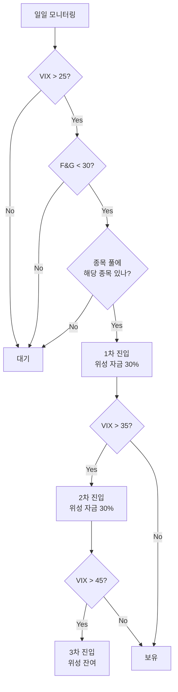

# 공포·탐욕을 숫자로 측정하기

## 5줄 요약

1. 공포·환희를 "느낌"이 아닌 "숫자"로 잡으면, 감정 매매를 시스템 매매로 전환할 수 있다.
2. 핵심 지표는 **VIX**(미국 변동성 지수), **CNN Fear & Greed Index**(7개 하위지표 종합), **AAII 개인투자자 심리지수**.
3. 한국 시장에는 **VKOSPI**(코스피200 변동성)와 **신용잔고/예탁금** 같은 보조지표가 있다.
4. 단일 지표보다 **2~3개 지표가 동시에 극단**일 때 진입 신호로 본다 (false positive 감소).
5. 박찬수님의 진입 룰 제안: VIX 25+ AND Fear & Greed Index 25↓ → 위성 자금 30% 진입.

---

## 1. VIX (CBOE Volatility Index)

### 정의

CBOE(시카고 옵션거래소)가 산출하는 **S&P 500 옵션의 향후 30일 내재변동성** 지수. 흔히 "공포 지수"라 부른다.

- **계산 방식**: S&P 500 콜·풋 옵션의 가중 평균 내재변동성
- **단위**: 연환산 % (예: VIX 20 = 향후 30일간 S&P 500이 ±20%/√12 ≈ ±5.8% 움직일 것이라는 시장 기대)

### 해석 가이드

| VIX 레벨 | 상태 | 역사적 빈도 | 의미 |
|----------|------|------------|------|
| < 12 | 극도의 안일 | 약 10% | 위험 의식 부재. 폭락 직전 종종 발생 |
| 12~20 | 정상 | 약 60% | 평상시 시장 |
| 20~30 | 우려 | 약 20% | 단기 조정 진행 중 |
| 30~40 | 공포 | 약 7% | 중기 패닉 — **컨트래리언 1차 신호** |
| 40~50 | 극공포 | 약 2% | 시스템 우려 — **컨트래리언 강한 신호** |
| 50+ | 패닉 | 약 1% | 위기 (08년 80, 20년 82) — **최고 기회** |

### 활용 룰 (제안)

```
VIX < 20: 무관심 (정상 시장, 위성 거래 중단)
VIX 20~25: 관심 (모니터링)
VIX 25~30: 1차 진입 (위성 자금의 25%)
VIX 30~40: 2차 진입 (위성 자금의 25% 추가)
VIX 40+: 3차 진입 + 코어 추가매수 검토 (위성 잔여 + 현금 활용)
```

### 데이터 조회 방법

```bash
# Yahoo Finance에서 ^VIX 티커로 조회
python3 -c "import yfinance as yf; print(yf.Ticker('^VIX').history(period='5d'))"
```

또는 [CNN VIX 페이지](https://www.cnn.com/markets/fear-and-greed) 또는 [TradingView VIX 차트](https://www.tradingview.com/symbols/CBOE-VIX/)에서 확인.

---

## 2. CNN Fear & Greed Index

### 정의

CNN이 매일 산출하는 **0~100 종합 심리 지수**. 7개 하위 지표를 가중 평균한다.

| 하위 지표 | 측정 대상 |
|----------|----------|
| Stock Price Momentum | S&P 500 vs 125일 이동평균 |
| Stock Price Strength | 52주 신고가 vs 신저가 비율 (NYSE) |
| Stock Price Breadth | McClellan Volume Summation Index |
| Put/Call Ratio | 5일 평균 풋/콜 비율 |
| Junk Bond Demand | 정크본드 vs 투자등급 채권 스프레드 |
| Market Volatility | VIX 50일 이동평균과의 비교 |
| Safe Haven Demand | 주식 vs 국채 20일 수익률 차이 |

### 해석 가이드

| 점수 | 상태 | 행동 |
|------|------|------|
| 0~25 | **Extreme Fear** | 컨트래리언 진입 신호 |
| 25~45 | Fear | 관심 |
| 45~55 | Neutral | 무관심 |
| 55~75 | Greed | 익절 검토 |
| 75~100 | **Extreme Greed** | 분할 익절 강행 |

### VIX보다 좋은 점

VIX는 옵션 시장 기반이라 **변동성**을 측정한다. 즉 "급락"과 "급등" 모두 VIX를 올린다 (이론적으로). 반면 Fear & Greed Index는 **방향성**을 포함하므로 "공포"와 "탐욕"을 분리한다.

### 한계

- CNN의 자체 산출이라 **계산 식이 100% 공개되지 않음**
- 미국 시장 기반 (한국 시장에는 직접 적용 어려움)
- 일별 변동이 커서 노이즈 존재

### 데이터 조회 방법

[CNN Fear & Greed 공식 페이지](https://www.cnn.com/markets/fear-and-greed)에서 매일 업데이트. API는 비공식이지만 일부 라이브러리로 추출 가능 (`fear-and-greed` Python 패키지).

---

## 3. AAII Investor Sentiment Survey

### 정의

미국 개인투자자협회(American Association of Individual Investors)가 매주 발표하는 **개인투자자 심리 설문**. Bullish / Neutral / Bearish 비율을 산출.

- 매주 목요일 발표
- 표본: 약 200~300명의 AAII 회원
- 1987년부터 데이터 축적

### 해석 가이드

```
Bullish - Bearish (Spread)

> +30: 과도한 낙관 (역지표, 매도 검토)
0 ~ +30: 정상
-10 ~ 0: 약한 비관
< -10: 강한 비관 (역지표, 매수 검토)
< -20: 극단적 비관 (역사적으로 12개월 후 +15% 이상 평균)
```

### 컨트래리언 활용

AAII는 **"개인 투자자의 정서"**를 측정하므로, 군중과 반대로 가는 박찬수님의 철학에 직접적으로 부합한다.

- AAII Bearish > 50% (극도 비관) → 6~12개월 후 양의 수익률 확률 75% 이상 (역사 통계)
- AAII Bullish > 60% → 6~12개월 후 부진 확률 높음

### 데이터 조회

[AAII Sentiment Survey 페이지](https://www.aaii.com/sentimentsurvey)에서 무료 조회 가능.

---

## 4. 한국 시장 — VKOSPI, 신용잔고, 예탁금

미국 지표(VIX, F&G)는 한국 시장 진입 판단에 **간접적**으로만 유효하다 (S&P와 코스피의 상관계수 0.6~0.7). 한국 단기 매매에는 한국 지표를 병행해야 한다.

### VKOSPI (코스피200 변동성 지수)

- 한국거래소가 산출하는 코스피200 옵션 기반 변동성 지수
- **VIX의 한국판**

| VKOSPI 레벨 | 상태 |
|-------------|------|
| < 15 | 안일 |
| 15~25 | 정상 |
| 25~35 | 우려 |
| 35+ | 공포 |
| 50+ | 패닉 (역대 평균 회복까지 6~12개월) |

조회: [한국거래소 KRX 정보데이터시스템](http://data.krx.co.kr/) 또는 Yahoo Finance `^VKOSPI`

### 신용잔고 (Margin Loan Balance)

개인투자자가 주식을 담보로 빌린 돈의 총액. **상승장 후반에 급증**하다가, 폭락 시 강제청산(반대매매)으로 급감.

- 신용잔고 급감 시점이 **단기 바닥** 신호인 경우가 많음 (강제청산 끝났다는 신호)
- 신용잔고 급증 시점은 **상승 후반** (주의 신호)

조회: 금융투자협회 [채권·신용정보](http://freesis.kofia.or.kr/) — 매일 업데이트

### 예탁금 (Customer Deposits)

증권 계좌에 들어 있는 현금. **"대기 자금"**으로 해석.

- 예탁금 급증 = 사람들이 사고 싶은데 진입 못 하고 있다 → 잠재 매수세 풍부
- 예탁금 급감 = 자금이 이미 시장에 들어갔다 → 매수 여력 소진

조회: 동일하게 금투협 정보.

---

## 5. 단일 지표의 함정 — 다중 지표 시스템 권장

**한 지표만 보면 false positive가 많다.** 다음 시나리오를 항상 의식하자:

- VIX만 30+: 변동성 급등이 꼭 매수 기회는 아님 (실제 펀더멘털 악화일 수도)
- Fear & Greed만 25↓: 단기 변동에 민감 (1~2일 만에 회복 가능)
- AAII만 극단: 주간 데이터라 반응 늦음

### 박찬수님 진입 룰 (제안)



**룰의 핵심**:
1. 두 지표가 **동시에** 극단일 때만 진입
2. **단계적 진입** — 한 번에 다 사지 않음 (더 떨어질 가능성 대비)
3. **종목 풀** 안에서만 매매 (즉흥 매매 금지)

---

## 6. 환희 측정 — 익절 신호

진입 신호가 거울처럼 작동한다.

| 지표 | 익절 검토 신호 |
|------|---------------|
| VIX | < 12 (극도 안일) |
| Fear & Greed | > 75 (Extreme Greed) |
| AAII Bullish - Bearish | > +30 |
| 신용잔고 | 사상 최고치 갱신 |

또한 **수익률 기반 분할 익절** ([[00-개요-공포에-사서-환희에-판다]] 참조):
- +10% → 1/3 매도
- +20% → 1/3 매도
- +30% → 잔여 매도

---

## 7. 데이터 자동 수집 스크립트 아이디어

향후 `_scripts/`에 추가하면 좋을 스크립트:

```python
# fetch_sentiment.py (예시 — 실제 작성 시 별도 요청)
def get_vix():
    """Yahoo Finance에서 VIX 일별 조회"""
    import yfinance as yf
    return yf.Ticker('^VIX').history(period='5d')

def get_vkospi():
    """VKOSPI 조회"""
    import yfinance as yf
    return yf.Ticker('^VKOSPI').history(period='5d')

def check_entry_signal():
    """진입 신호 종합 판정"""
    vix = get_vix().iloc[-1]['Close']
    # F&G는 별도 스크래핑 필요
    if vix > 25 and fear_greed < 30:
        return "1차 진입 가능"
    return "대기"
```

만들고 싶으면 "공포지표 스크립트 만들어줘"라고 말씀해 주세요.

---

## 참고 자료

- [CBOE VIX 공식 사이트](https://www.cboe.com/tradable_products/vix/)
- [CNN Fear & Greed Index](https://www.cnn.com/markets/fear-and-greed)
- [AAII Sentiment Survey](https://www.aaii.com/sentimentsurvey)
- [한국거래소 정보데이터시스템](http://data.krx.co.kr/)
- [금융투자협회 FreeSIS](http://freesis.kofia.or.kr/) — 신용잔고/예탁금
- Howard Marks, *Mastering the Market Cycle* (2018) — 사이클 인식 프레임워크
