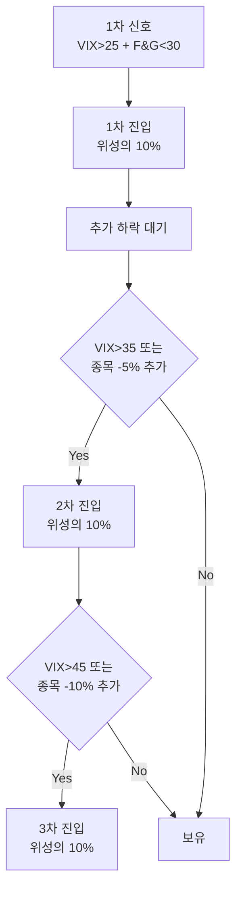

# 포지션 사이징 — 한 번에 얼마를 베팅할까

## 5줄 요약

1. 좋은 종목을 골라도 **얼마를 베팅하느냐**가 장기 수익률을 결정한다. 사이징은 종목 선정만큼 중요하다.
2. **1R 룰**(=1% 손실 한도): 한 번의 트레이드에서 잃을 수 있는 최대 금액을 위성 자금의 1%로 제한.
3. **켈리 공식**(Kelly Criterion): 승률과 페이오프를 알면 최적 베팅 비율을 계산할 수 있다. 다만 실전에선 **1/4 켈리** 정도로 보수적으로 적용.
4. 박찬수님 룰 제안: 1회 트레이드 = **위성 자금의 30% 이내** + 분할 진입.
5. 절대 금지: ① 한 번에 다 박기 ② 손실 후 베팅 키우기(역마틴게일 제외) ③ 코어 자금 침범.

---

## 1. 왜 포지션 사이징이 중요한가

### 사례: 같은 승률, 다른 결과

박찬수님 위성 자금이 ₩500만이라고 가정. 승률 60%, 평균 +20%/-15%인 종목을 매매한다고 할 때:

**사이징 A** — 매번 30%(₩150만) 베팅, 100회 매매:
- 기대 수익: ₩500만 × (1 + 0.6×0.2×0.3 − 0.4×0.15×0.3)^100 ≈ ₩500만 × 4.4 = ₩2,200만

**사이징 B** — 매번 100%(₩500만) 베팅, 100회 매매:
- 기댓값은 더 높아 보이지만, **단 한 번의 -50% 사건**으로 자금 절반 증발 → 회복까지 다음 +100%가 필요
- **파산 확률(Risk of Ruin)** 높음

**사이징 C** — 1% 베팅(₩5만), 100회 매매:
- 안전하지만 수익률 미미

**핵심**: 사이징은 "얼마를 벌까"보다 **"얼마를 잃지 않을까"**를 결정한다. 잃지 않으면 시간이 자산을 키운다.

### 켈리의 깨달음

물리학자 John Kelly(1956)가 도박·투자 최적 베팅 비율을 수식으로 정리:

```
f* = (bp - q) / b

f* = 베팅 비율 (자금 대비)
b = 페이오프 비율 (이길 때 수익 / 질 때 손실)
p = 승률
q = 패율 (1 - p)
```

예: 승률 60%, 평균 +20% / -10% (b = 2):
```
f* = (2 × 0.6 - 0.4) / 2 = 0.8 / 2 = 0.4 = 40%
```

이론적 최적 베팅은 자금의 40%지만, 실전에선 **승률·페이오프 추정 오차** 때문에 **1/4 켈리(=10%)** 정도로 축소 적용한다.

---

## 2. 1R 룰 (1 Risk per Trade)

### 정의

**한 번의 트레이드에서 잃을 수 있는 최대 금액 = 위성 자금의 1%**

이를 **1R**이라 부른다. R = Risk.

### 적용 방법

```
위성 자금 = ₩500만
1R = ₩500만 × 1% = ₩5만 (한 트레이드에서 최대 잃을 금액)

진입가 ₩100,000, 손절가 ₩90,000 (-10%)일 때:
1주당 손실 = ₩10,000
허용 매수 수량 = 1R / 1주당 손실 = ₩5만 / ₩1만 = 5주
필요 자금 = 5주 × ₩100,000 = ₩50만 (위성 자금의 10%)
```

### 변형: 0.5R, 2R 룰

- **0.5R** (= 0.5%): 보수적, 100회 트레이드 시 자금 보존 우선
- **1R** (= 1%): 표준
- **2R** (= 2%): 공격적, 확신 강할 때만

박찬수님 추천: **1R 표준**. 다만 진짜 시스템적 공포(VIX 50+) 시점에는 **2R~3R**까지 허용 (역사적으로 12개월 후 회복 확률 높음).

### 왜 1%인가 — 파산 확률 계산

승률 50%, 1R = 1% 가정 시:
- 100회 연속 손실 확률 ≈ 7.9 × 10^-31 (사실상 0)
- 자금 50% 손실까지 약 70회 손실 필요 → 시간이 오래 걸려서 다른 신호 점검 가능

승률 50%, 1R = 10% 가정 시:
- 자금 50% 손실 = 7회 연속 손실 → 발생 확률 ≈ 0.78%
- 1년에 한 번 정도는 발생 가능 → 위험

---

## 3. 박찬수님 룰 제안

### 베팅 단위

```
위성 자금 = 전체 자산의 10~20%

예: 전체 자산 ₩2,500만 (현재 추정)
위성 자금 = 10% = ₩250만 (보수적)
        또는 20% = ₩500만 (공격적)

1회 트레이드 = 위성 자금의 30% 이내 = ₩75만 ~ ₩150만
```

### 분할 진입 룰

한 번의 매매 신호에 대해 **3단계 분할 진입**:



총 진입 한도: 위성 자금의 30% (한 종목당)

### 동시 보유 한도

**최대 3개 포지션**까지 동시 보유. (= 위성 자금의 90% 사용)

이유:
- 너무 많은 포지션은 추적 불가능
- 분산이 너무 강해지면 단기 트레이딩의 의미 상실 (그럴 거면 ETF가 낫다)
- 코어 자금 + 현금 30%와 분리 유지

### 손절 가격

진입 후 **-15% 도달 시 강제 손절**.

이유:
- -15%는 일반적 단기 조정과 시스템적 하락의 경계선
- 손절 후 회복 기다리는 것보다 다음 기회 잡는 게 통계적으로 유리

**예외**: thesis가 명확히 살아있으면 -20%까지 보유 가능 (드물어야 함). 박찬수님은 thesis 우선이지만, 단기 트레이딩에선 thesis 검증이 어려우므로 가격 손절을 우선.

---

## 4. 익절 룰 (Profit Taking)

진입은 분할, 익절도 분할.

### 표준 분할 익절

```
+10% 도달: 보유분 1/3 매도
+20% 도달: 보유분 1/3 매도 (=원 진입의 1/3)
+30% 도달: 잔여 1/3 매도

또는

+15% 도달: 1/2 매도
+30% 도달: 잔여 1/2 매도
```

### 시간 기반 강제 청산

**진입 후 30 거래일 경과 시 무조건 청산.**

이유:
- 단기 트레이딩이 장기 보유로 변질 방지
- 30일 동안 +10%도 못 오르는 종목은 thesis가 약했다는 증거
- 자금을 다시 회전시켜야 다음 기회 진입 가능

### Trailing Stop

수익 구간에서 후퇴 시 강제 청산.

```
+10% 도달 후 진입가까지 되돌아오면 청산 (= break-even stop)
+20% 도달 후 +10%까지 되돌아오면 청산 (= half profit stop)
+30% 도달 후 +20%까지 되돌아오면 청산
```

---

## 5. 사이징 계산기 (간단 버전)

엑셀 또는 Obsidian에서 사용 가능한 계산식:

```
[입력]
- 위성 자금: ₩5,000,000
- 1R 비율: 1%
- 진입가: ₩100,000
- 손절가: ₩85,000 (-15%)

[계산]
- 1R 금액 = 5,000,000 × 1% = 50,000
- 1주당 손실 = 100,000 - 85,000 = 15,000
- 매수 수량 = 50,000 / 15,000 = 3.33주 → 3주
- 필요 자금 = 3주 × 100,000 = 300,000 (위성의 6%)
- 손절 시 손실 = 3주 × 15,000 = 45,000 (1R 이내)
```

**권장**: 매매 전 항상 이 계산을 매매일지에 기록. "왜 이 수량인가?"를 명시적으로 답해야 즉흥 매매 방지.

---

## 6. 절대 금지 — 사이징 자살 행위

### 1) 한 번에 다 박기

"이번엔 확신이 들어!" → 100회 중 5번 정도는 필연적으로 깨진다. 한 번에 다 박으면 그 5번 중 한 번에 위성 전체 증발.

### 2) 마틴게일 (Martingale) — 손실 후 베팅 키우기

"이번엔 빠지면 더 사야지" → 켈리 공식의 정반대. 떨어지는 칼날에 점점 더 많이 박는 행위.

**예외**: 분할 진입은 **사전에 계획된** 단계적 매수. 손실 누적 후 즉흥적으로 늘리는 것과는 다름.

### 3) 코어 자금 침범

"위성 자금 다 썼는데 좋은 신호가 또 왔어" → 다음 기회로 넘긴다. 절대 코어 자금이나 현금 30%를 침범하지 않는다.

### 4) 한 종목에 위성 100% 박기

"SK하이닉스 확실해" → 동시 보유 한도(위성 90% = 한 종목 30%)를 어기지 않는다.

### 5) 변동성 ETF에 1R 룰 위반

TQQQ, SOXL 같은 3배 레버리지는 -50% 하루 가능. 일반 1R 계산 시 매수량이 과도해진다.

**권장**: 레버리지 ETF는 **0.3R~0.5R 룰**로 축소 적용.

---

## 7. 박찬수님 SK하이닉스 단타 사이징 분석 (사후 평가)

거래내역 분석:

```
4/2 매수: 7주 × 평균 ₩856,143 = ₩6,000,000
```

만약 위성 자금이 ₩2,000만이라면:
- 1회 트레이드 자금 = ₩600만 (위성의 30%) ✅ 적정
- 1R 한도 = ₩20만 (위성의 1%)
- 손절가 -15% 가정 시 1주당 손실 = ₩128,000
- 1R 한도 내 매수량 = 20만/12.8만 = 1.5주 → 1주만 가능

**즉, 사이징 룰 기준으로는 7주 매수는 1R 룰을 6배 초과한 베팅**.

다행히 +24%로 끝났지만, 같은 진입에서 -15%가 났다면 위성 자금의 5~6%(₩100만+)가 날아갔다.

### 다음 단계 권고

1. 위성 자금 규모 명확화 (₩? 만)
2. 1R 룰 명문화 → 매매 전 사이징 계산 의무화
3. 매매일지에 사이징 근거 기록

---

## 다음 단계

- [[04-매매일지-시스템]] — 사이징 결정을 어떻게 기록하고 검증할까

---

## 참고 자료

- John L. Kelly Jr., *A New Interpretation of Information Rate* (1956) — 켈리 공식 원전
- Edward Thorp, *Beat the Dealer* (1962), *Beat the Market* (1967) — 켈리 공식의 실전 적용
- Van K. Tharp, *Definitive Guide to Position Sizing* (2008) — 1R 룰의 체계화
- William Poundstone, *Fortune's Formula* (2005) — 켈리 공식의 역사와 실전 사례
