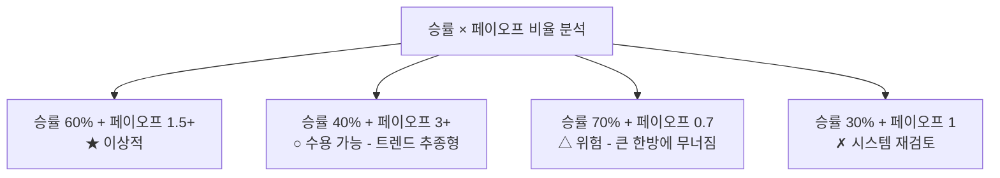

# 매매일지 시스템

## 5줄 요약

1. 단기 트레이딩의 90%는 **자기 검증**이다. 매매일지 없이는 운인지 실력인지 분리 불가능.
2. 매매일지는 **진입 직후**(1분 이내) 작성한다. 결과를 알기 전에 thesis를 박제해야 후행 합리화를 막을 수 있다.
3. **30회 매매 누적** 시 통계 분석: 승률, 평균 수익/손실, R-multiple, 평균 보유 기간.
4. 매매일지에서 발견되는 **반복 패턴**이 진짜 자산이다 (ex: "FOMO로 진입한 트레이드는 80% 손실").
5. 박찬수님 매매일지는 `04-Trading-Journal/`에 저장. 단기 매매는 별도 태그(`#trading-pool`)로 분리.

---

## 1. 왜 매매일지가 필수인가

### 인간의 기억은 왜곡된다

인지 심리학 연구에 따르면, 인간은 다음과 같이 기억을 왜곡한다:

- **자기 봉사적 편향 (Self-serving bias)**: 성공은 실력, 실패는 운으로 기억
- **사후 합리화 (Hindsight bias)**: "그럴 줄 알았어"라고 기억 조작
- **선택적 기억 (Selective memory)**: 강하게 인상 남은 매매만 기억, 평범한 매매는 잊음

→ **결과적으로**: "나는 단기 매매로 50% 수익률을 냈다"는 기억은 종종 **실제로는 0~5%** 수준이거나 마이너스인 경우 많음.

### SK하이닉스 사례 — 박찬수님 한 번의 +24%는 무엇을 의미하나?

거래내역 분석에서 본 +24% 수익은 객관적 사실이다. 그러나:

- **표본 1**: 통계적으로 무의미. 우연일 확률 ≥ 50%
- **다음 매매가 -30%일 가능성**도 동일한 정도로 존재
- **30회 매매 후** 평균이 +5%로 수렴할 수도, +15%로 수렴할 수도 있음

매매일지가 없으면, 1년 뒤 박찬수님 기억에는 **"SK하이닉스 단타 잘했어"**만 남고, 그 사이의 작은 손실 매매들은 사라진다.

---

## 2. 매매일지의 두 시점 — 진입 직후 + 사후 복기

### 진입 직후 (1분 이내) — Pre-mortem

매매를 체결한 직후, **결과를 알기 전에** 다음을 기록:

```yaml
---
date: 2026-04-26
ticker: SK하이닉스 (000660)
action: 매수
quantity: 7
price: 856000  # 평균 매수가
total: 5990000
position_size_pct: 12  # 위성 자금 대비 %
type: trading-pool
---

## 진입 thesis
- 트리거: VIX 27, Fear & Greed 23 (Extreme Fear)
- 종목 thesis: HBM 1위, AI 인프라 capex 회복 신호
- 가격 상황: 52주 고점 대비 -18%, 60일 이동평균 하방

## 진입 룰 체크
- [x] VIX > 25
- [x] Fear & Greed < 30
- [x] 종목 풀에 포함
- [x] 1R 룰 적용 (손절 -15% 시 ₩89만 손실 → 위성의 1.8% — 약간 초과 ⚠️)
- [ ] 분할 진입 1차만 완료 (2차/3차 대기)

## 청산 계획
- 익절: +10% 도달 시 1/3, +20% 시 1/3, +30% 시 잔여
- 손절: -15% 도달 시 강제 청산
- 시간 청산: 30 거래일 경과 시 무조건 청산

## 진입 시 감정 상태
- 평소대로 (1~10 척도에서 "확신" = 7/10)
- FOMO 없음
- 손실 회복 욕구 없음

## 미래의 나에게 (이 매매가 끝났을 때 무엇을 확인할 것인가)
- thesis가 작동했나? (HBM 회복이 실제 주가 동력이었는가?)
- 진입 트리거가 신뢰할 만했나? (VIX 27이 진짜 공포였나, 작은 조정이었나?)
- 청산 룰을 지켰나? (감정에 따라 일찍/늦게 팔지 않았나?)
```

**핵심**: thesis와 청산 계획을 미리 적어야 사후 합리화가 불가능해진다.

### 사후 복기 — Post-mortem (청산 1주일 후)

청산 후 1주일 뒤(또는 시간 청산 시) 다음을 추가:

```yaml
## 청산 결과
- 청산일: 2026-04-08, 2026-04-16
- 평균 청산가: 1,038,000 (가중평균)
- 수익률: +21.4%
- 절대 수익: ₩1,170,000
- R-multiple: +1.4R (1R = 1% 위성 = ₩50만, 실제 +₩117만 = +2.34R 가까이)

## thesis 검증
- HBM 회복 thesis 작동했나?: ✅ 외국인 매수세 동반, 메모리 가격 상승 뉴스
- 시장 전체 반등 효과인가?: △ 같은 기간 KOSPI도 +5%, 알파(초과수익)는 +16%
- 즉, **종목 선정**이 작동했음 (시장 평균보다 잘함)

## 청산 룰 준수
- [x] +20% 도달 시 1/3 매도? → 4/8 6주 매도, 1주 보유 (60% vs 권장 33%)
       — 룰 위반: 너무 많이 팔았다 (혹은 +30% 룰을 무시했다)
- [x] +30% 도달 시 잔여 매도? → 4/16 1주 매도 (+34.8%) ✅

## 감정 회고
- 매도 직전 감정: "더 떨어질까 봐" 두려움
- 매도 직후 감정: "더 갔으면 어땠을까" 후회 (1주만 보유했어야 했나?)
- 다음에 개선할 것: 분할 매도 비율을 미리 정해놓고 기계적으로 실행

## 운 vs 실력
- 운적 요소: 코스피 전체 반등이 우연히 같은 기간 발생
- 실력적 요소: VIX 27 시점에 종목 풀 안의 SK하이닉스 선정 + 분할 진입
- 비율: 약 50:50 (한 케이스로 단정 어려움)

## 다음 매매에 적용할 lessons learned
1. 분할 매도 비율 사전 명시 (1/3 - 1/3 - 1/3 또는 1/2 - 1/2)
2. 청산 가격 도달 즉시 매도 (감정 개입 차단)
3. 1R 룰 약간 초과 — 다음엔 위성 자금 대비 비중 더 정확히 계산
```

---

## 3. 매매일지 파일 구조

### 파일 위치 및 명명

```
04-Trading-Journal/
├── 2026-04-02-매수-SK하이닉스.md       # 진입 일지 (진입 직후 작성)
├── 2026-04-08-매도-SK하이닉스.md       # 청산 일지
├── 2026-04-16-매도-SK하이닉스.md       # 추가 청산 일지
├── 2026-Q2-단기트레이딩-복기.md       # 분기 단기 매매 통계
└── 2026-Q2-복기.md                     # 분기 전체 복기
```

### 단기/장기 분리 태그

frontmatter에 `type` 필드:
- `type: trading-pool` → 단기 매매
- `type: core-position` → 코어 매매 (NVDA 추가매수 등)
- `type: idea-driven` → 아이디어에서 출발한 매매

이렇게 분리하면 분기 복기 시 단기/장기 성과를 따로 분석 가능.

### 템플릿

`Templates/tpl-매매일지.md`가 있는지 확인 후, 단기 매매용 별도 템플릿 추가 권장:

```
Templates/
├── tpl-매매일지.md           # 기존 일반 매매일지
├── tpl-매매일지-단기.md      # ← 단기 트레이딩 전용 (진입 룰 체크리스트 포함)
└── tpl-복기.md               # 기존 정기 복기
```

이 템플릿을 만들고 싶으면 "단기 매매일지 템플릿 만들어줘"라고 말씀해 주세요.

---

## 4. 30회 매매 후 통계 분석

### 분석 항목

매매 30회 누적 시 다음을 산출:

| 지표 | 의미 | 박찬수님 목표 |
|------|------|--------------|
| **승률** | 수익으로 끝난 매매 비율 | 50% 이상 |
| **평균 수익률 (승)** | 이긴 매매의 평균 수익 | +15% 이상 |
| **평균 손실률 (패)** | 진 매매의 평균 손실 | -10% 이내 |
| **페이오프 비율 (b)** | 평균수익 / 평균손실 | 1.5 이상 |
| **기댓값 (E)** | 승률×평균수익 - 패율×평균손실 | +0.5% 이상 |
| **평균 보유 기간** | 진입~청산 거래일 | 5~20일 |
| **R-multiple 분포** | 1R 단위 수익 분포 | 평균 +0.5R 이상 |
| **연환산 수익률** | (1+E)^매매빈도 - 1 | 위성 자금 +20% 이상 |
| **최대 낙폭 (MDD)** | 자금 곡선의 최대 하락 | 위성의 -25% 이내 |

### 손익비-승률 매트릭스



승률만 봐서는 안 되고, **페이오프 비율과 함께** 봐야 한다.

### 도구

향후 `_scripts/`에 매매일지 통계 스크립트 추가 가능:

```python
# analyze_trading_journal.py (예시)
def analyze_journal(journal_dir, type_filter='trading-pool'):
    """
    매매일지를 읽어서 승률, 페이오프, 기댓값 산출
    """
    trades = load_trades(journal_dir, filter=type_filter)
    wins = [t for t in trades if t.pnl > 0]
    losses = [t for t in trades if t.pnl < 0]

    win_rate = len(wins) / len(trades)
    avg_win = mean([t.pnl_pct for t in wins])
    avg_loss = mean([t.pnl_pct for t in losses])
    payoff = avg_win / abs(avg_loss)
    expected_value = win_rate * avg_win + (1-win_rate) * avg_loss

    return {
        'count': len(trades),
        'win_rate': win_rate,
        'avg_win': avg_win,
        'avg_loss': avg_loss,
        'payoff': payoff,
        'expected_value': expected_value
    }
```

만들고 싶으면 "매매 통계 스크립트 만들어줘"라고 말씀해 주세요.

---

## 5. 패턴 발견 — 매매일지의 진짜 자산

30회 누적되면 다음 같은 패턴이 보인다:

### 예시 1: 시간대별 승률
- 장 시작 30분 내 매수: 승률 30%
- 장 마감 30분 내 매수: 승률 65%
→ "장 마감 직전 진입이 통계적으로 유리하다"

### 예시 2: 트리거별 승률
- VIX 25~30 진입: 승률 55%, 평균 +12%
- VIX 30~40 진입: 승률 70%, 평균 +18%
- VIX 40+ 진입: 승률 85%, 평균 +25%
→ "더 큰 공포일수록 더 큰 기회 (단, 빈도 낮음)"

### 예시 3: 종목별 승률
- SK하이닉스: 5회 매매, 승률 80%, 평균 +16%
- 데브시스터즈: 3회 매매, 승률 33%, 평균 -8%
→ "SK하이닉스에 집중하고 데브시스터즈는 풀에서 제외 검토"

### 예시 4: 감정-결과 상관성
- 진입 시 "확신 9/10"으로 표시한 매매: 승률 45% (낮음!)
- 진입 시 "확신 5/10"으로 표시한 매매: 승률 62%
→ "내 감정적 확신은 역지표일 수 있다" (오버 컨피던스 패턴)

**이런 패턴이 매매일지의 진짜 가치다.** 단순한 승률·수익률보다 **자기 자신을 알아가는 과정**이 핵심.

---

## 6. 정기 복기 (Post-Mortem)

### 분기 복기

매분기 마지막에 다음 작성:

```
04-Trading-Journal/2026-Q2-단기트레이딩-복기.md
```

내용:
- 분기 단기 매매 통계 (승률, 페이오프, 기댓값)
- 발견된 패턴 (시간대, 종목, 감정 등)
- 시스템 개선 사항 (룰 변경, 종목 풀 갱신, 사이징 조정)
- 다음 분기 가설 (어떤 변수를 테스트할 것인가)

### 반기/연간 복기

- 단기 vs 코어 vs 현금 비중 변화 추적
- 단기 트레이딩이 전체 수익률에 기여한 정도 (양수? 음수?)
- 단기 트레이딩 지속 vs 중단 결정

**중요한 결정**: 단기 트레이딩이 1년간 코어 보유 수익률보다 낮다면, 단기 매매를 **중단할 용기**도 필요.

---

## 7. 매매일지 작성 자동화 (향후)

매매가 발생할 때마다 자동으로 일지 초안을 만드는 스크립트 가능:

```python
# auto_journal.py (예시)
def create_journal_from_toss(date):
    """
    토스 거래내역에서 그날의 매매를 읽어 일지 초안 생성
    """
    orders = toss_account.get_orders(date)
    for order in orders:
        create_journal_note(order, type='trading-pool')
```

만들고 싶으면 "매매일지 자동 생성 스크립트 만들어줘"라고 말씀해 주세요.

---

## 8. 박찬수님 행동 권고

### 즉시 시작

1. **2026-04-02 SK하이닉스 매수 사후 일지 작성** — 데이터는 이미 있으니 backfill 가능
2. **2026-04-08, 2026-04-16 매도 일지 작성**
3. 위 매매를 첫 번째 데이터 포인트로 30회 카운트 시작

### 단기

1. `Templates/tpl-매매일지-단기.md` 템플릿 작성 (요청 시 진행)
2. 매매 발생 → 진입 후 1분 내 일지 작성 습관화
3. 1주일 후 청산 시 사후 복기 작성

### 30회 누적 시점

1. 통계 분석 (스크립트 또는 수동)
2. 패턴 발견 → 룰 개선
3. 단기 매매 지속 vs 조정 결정

---

## 다음 단계

- [[05-토스-수수료-무료-활용]] — 단기 매매의 비용 구조 최적화

---

## 참고 자료

- Mark Douglas, *Trading in the Zone* (2000) — 트레이더 심리, 일관성 유지
- Brett Steenbarger, *The Daily Trading Coach* (2009) — 매매일지 활용법
- Van K. Tharp, *Trade Your Way to Financial Freedom* (1998) — R-multiple, 시스템 평가
- 박찬수님의 토스 거래내역 (`_trade-data/output/`) — 자동 분석용 원천 데이터
