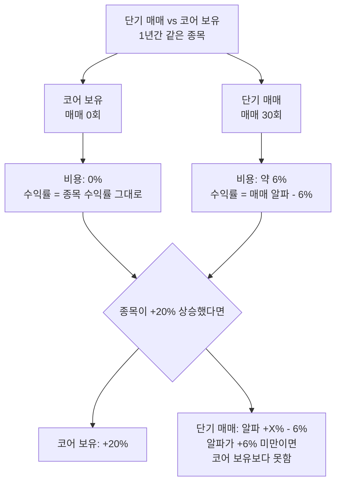

# 토스증권 수수료 무료 활용

## 5줄 요약

1. 토스증권 국내주식 수수료 무료 정책으로 단기 매매의 **명목 거래비용**이 큰 폭 절감된다.
2. 다만 **거래세(매도 시 0.18%)는 정부 부과 항목**이라 수수료 무료와 무관하게 그대로 발생한다.
3. 단기 매매 100회 시 거래세 누적 약 **9~18%** (회전율 따라). 수수료 무료여도 비용은 작지 않다.
4. 함정 회피: "수수료 무료니까 막 사고 팔자" → 거래세 무시 시 연 수익률 -10%까지 까임.
5. 활용 룰: ① 한국 단기 매매는 토스로 통일 ② 매매 횟수 자체는 룰로 통제 ③ 미국 종목은 별도 (수수료 무료 아님).

---

## 1. 한국 주식 거래비용의 구조

한국 시장에서 주식 1회 매매(매수+매도) 시 발생하는 비용:

| 항목 | 비율 | 부과 시점 | 수수료 무료 영향 |
|------|------|----------|-----------------|
| **위탁 수수료** | 0.015~0.5% | 매수+매도 양쪽 | ✅ 토스 무료 |
| **유관기관 제비용** | 약 0.0036% | 매수+매도 | △ 보통 면제되지 않음 (소액) |
| **증권거래세** (매도) | **0.18%** (코스피) **0.18%** (코스닥) | 매도 시만 | ❌ 정부 부과, 무관 |
| **농어촌특별세** (매도, 코스피만) | 0.15% (거래세 일부) | 매도 시 | ❌ 정부 부과 |

(증권거래세율은 정부 정책에 따라 변동될 수 있음 — 가장 최신 세율은 [국세청 자료](https://www.nts.go.kr/) 확인)

### 1회 매매 (매수→매도) 총 비용 — 일반 증권사 vs 토스

**일반 증권사 (수수료 0.015%) — 매도가 100,000원 기준**

```
매수 수수료: 100,000 × 0.015% = 15원
매도 수수료: 100,000 × 0.015% = 15원
거래세: 100,000 × 0.18% = 180원
유관제비용: 약 7원
─────────────────────────
1회 매매 총비용: 약 217원 (= 매도가의 0.217%)
```

**토스증권 (수수료 무료) — 매도가 100,000원 기준**

```
매수 수수료: 0원 (무료)
매도 수수료: 0원 (무료)
거래세: 100,000 × 0.18% = 180원
유관제비용: 약 7원
─────────────────────────
1회 매매 총비용: 약 187원 (= 매도가의 0.187%)
```

**절감 효과**: 1회 매매당 약 **0.03%** (30bps).

작아 보이지만, **회전율이 높을수록 효과가 커진다.**

---

## 2. 회전율별 비용 누적 효과

위성 자금 ₩500만으로 같은 자금을 매매한다고 가정.

| 매매 빈도 | 일반 증권사 (0.217%/회) | 토스 (0.187%/회) | 절감 |
|----------|----------------------|-----------------|------|
| 월 2회 (연 24회) | 5.21% | 4.49% | 0.72% |
| 월 5회 (연 60회) | 13.02% | 11.22% | 1.80% |
| 월 10회 (연 120회) | 26.04% | 22.44% | 3.60% |

**해석**:
- 매매 빈도가 높아질수록 토스의 절감 효과 커짐
- 그러나 거래세(0.18% × 회전율)는 여전히 누적
- 연 120회 매매하면 **수수료 무료 토스에서도 비용만 22%** → 연 수익률 +22% 이상 못 내면 마이너스

### 이게 뜻하는 바

박찬수님의 단기 매매 룰(VIX 25+ 시점에만 진입)대로면 **연 매매 빈도는 5~15회 정도**가 자연스럽다. 이 정도면 토스 수수료 무료의 절감 효과 + 낮은 거래세 부담으로 **단기 매매가 충분히 의미 있는 수익**으로 이어진다.

문제는 "수수료 무료니까 자주 사고 팔자"는 함정에 빠지는 경우.

---

## 3. 토스증권 수수료 무료 정책 — 정확한 적용 범위

⚠️ **불확실성 명시**: 정확한 정책 조건(영구 무료인지 한시 정책인지, 일부 종목 제외인지 등)은 토스증권 공식 안내를 확인해야 한다. 다음은 일반적으로 알려진 내용이며, 변경 가능성 있음.

### 일반적으로 알려진 조건

- 국내 주식 매매 수수료 무료 (코스피, 코스닥)
- 미국 주식은 **별도 정책** — 보통 0.07% 수준 또는 수수료가 일정 부분 부과됨
- 거래세, 유관기관 제비용, 환전 수수료(미국주식)는 정책 무관 별도 부과
- ETF, ETN 등 일부 상품은 별도 조건일 수 있음

### 확인이 필요한 사항

박찬수님이 토스증권 앱에서 직접 확인:

1. 현재 적용 중인 수수료 정책 페이지 (이용약관 또는 공지사항)
2. 종목 유형별 수수료 (일반 주식 vs ETF vs 해외 종목 vs 신주인수권)
3. 정책 종료일 또는 변경 가능성 안내

### 만약 무료 정책이 종료된다면

- 박찬수님 매매 빈도 기준으로 비용 영향은 연 0.5~2% 수준
- 정책 종료 시점에 매매 빈도를 조절하거나 다른 증권사로 이전 검토

---

## 4. 미국 주식은 어떻게 할까

### 토스의 미국 주식 정책

토스증권에서 미국 주식 매매 시:
- **수수료**: 일반적으로 0.07% (변동 가능)
- **환전 수수료**: 환전 시 환율 우대 정책이 있을 수 있으나, 매도 후 원화 환전 시 추가 비용 발생
- **거래세**: 미국은 한국과 달리 매도 거래세 없음 (대신 SEC fee 0.0008% 등 미세한 비용)

### 한국 vs 미국 단기 매매 비용 비교

```
한국 (토스 수수료 무료, 거래세 0.18%):
  1회 매매 비용 ≈ 0.187%

미국 (토스 0.07%, 거래세 없음):
  1회 매매 비용 ≈ 0.14% (수수료 양방향 + SEC fee)
  (단, 환전 비용 별도)
```

**결론**:
- **한국 단기 매매**는 토스 수수료 무료 효과가 크지만, 거래세 부담 존재
- **미국 단기 매매**는 거래세 부담은 작지만, 수수료가 부과됨 + 환전 부담
- 종합적으로 둘 다 가능하지만, **한국 위주**가 박찬수님 단기 트레이딩에 유리

---

## 5. 박찬수님 비용 구조 활용 룰

### 룰 1: 단기 매매는 한국 위주

- 위성 자금의 **70%는 한국 종목 매매**에 할당 (토스 수수료 무료 활용)
- 30%는 미국 ETF (QQQ, SMH, SOXL 등) 매매 가능 — 단 비용 부담 의식

### 룰 2: 매매 빈도 상한

연간 단기 매매 횟수 **상한 30회** 설정.

이유:
- 30회 = 거래세 약 5.4% + 기타 비용 → 총 비용 6% 수준
- 연 수익률 +10% 이상이면 의미 있는 알파
- 매매 빈도 늘리면 비용이 알파를 잡아먹음

### 룰 3: 매매 직전 비용 인식

매매 일지에 **예상 비용**을 명시:

```yaml
## 비용 추정
- 매수 수수료: 0원 (토스 무료)
- 매도 수수료: 0원 (토스 무료)
- 예상 거래세: 매도가 × 0.18% = 약 ₩XXX
- 예상 유관제비용: 약 ₩X
- 손익분기점: 진입가 + 거래세 (≈ +0.187%)
- 즉, 진입 후 +0.2% 미만은 사실상 손실
```

→ 이 인식이 있으면 "+0.5%만 먹고 빠지자" 같은 의미 없는 매매를 방지.

### 룰 4: 코어 종목 매매도 토스로

박찬수님 보유 종목 중 **한국 종목**(현재 동국제약 1주만 있음)을 추가 매수할 때도 토스 사용. 미국 코어(NVDA, GOOGL 등)는 기존 사용 증권사 그대로.

---

## 6. 토스의 추가 활용 — 시세 조회·체결내역 자동화

### 이미 구축된 도구

`_scripts/toss_account.py`로 다음 기능 자동화 가능:

```bash
# 포지션 조회
cd default/_scripts && python3 toss_account.py positions --market all

# 체결내역 조회
cd default/_scripts && python3 toss_account.py orders

# 종합 요약
cd default/_scripts && python3 toss_account.py summary

# 시세 조회
cd default/_scripts && python3 toss_account.py quote --symbol NVDA --symbol 005930
```

### 매매 자동화 (수동 확인 필수)

```bash
# 매수 미리보기 (실행 X)
cd default/_scripts && python3 toss_trade.py preview --symbol 000660 --side buy --qty 7 --price 856000

# 매수 실행 (사용자 명시 확인 후)
cd default/_scripts && python3 toss_trade.py execute --symbol 000660 --side buy --qty 7 --price 856000
```

⚠️ **CLAUDE.md 매매 워크플로우 규칙**: 사용자가 명시적으로 "실행해" 또는 "주문 넣어"라고 해야만 실행. Claude가 스스로 매매 판단하지 않는다.

### 향후 자동화 아이디어 (요청 시 작성)

1. **공포 신호 알림**: VIX > 25 또는 F&G < 30 시점에 알림 (Telegram/Discord)
2. **매매일지 자동 생성**: 토스 체결 발생 → 매매일지 초안 자동 생성
3. **분기 통계 대시보드**: `04-Trading-Journal/`의 매매일지를 읽어 승률/페이오프 자동 산출

---

## 7. 단기 매매 vs 코어 보유 — 비용 관점 비교



**중요한 인식**: 단기 매매는 **'코어 보유보다 매매 알파를 6% 이상 더 뽑아내야 의미가 있다.'**

이 기준이 까다로운 이유로, 진짜 시스템적 공포(VIX 35+) 시점에만 매매하는 룰이 합리적.

---

## 8. 박찬수님 즉시 행동 가능한 항목

1. **토스증권 정책 확인**: 앱에서 현재 수수료 정책 캡처해서 `06-Knowledge/단기-트레이딩/_토스-정책-2026-04.md`로 저장 (정책 변경 추적용)
2. **단기 매매 비용 트래킹**: `04-Trading-Journal/`에서 매매일지 작성 시 비용 항목 의무 기록
3. **분기 비용 합계**: 분기말 거래내역에서 총 거래세·수수료 산출 → 알파(수익률 - 비용)가 양수인지 확인

---

## 다음 단계

- 종목 풀 사전 카드 작성 (`01-Watchlist/KR/`에 SK하이닉스, 한미반도체 등 카드)
- 단기 매매일지 템플릿 작성 (`Templates/tpl-매매일지-단기.md`)
- 첫 번째 매매일지 backfill (2026-04-02 SK하이닉스 매수 건)

이들을 진행하고 싶으면 각각 요청해 주세요.

---

## 참고 자료

- 토스증권 공식 [수수료 안내](https://www.tossinvest.com/) — 사용자 직접 확인 필요
- 한국거래소 [거래수수료 안내](http://www.krx.co.kr/main/main.jsp)
- 국세청 [증권거래세 안내](https://www.nts.go.kr/) — 세율 및 변경 이력
- 금융투자협회 [전자공시](http://dis.kofia.or.kr/) — 증권사별 수수료 비교
