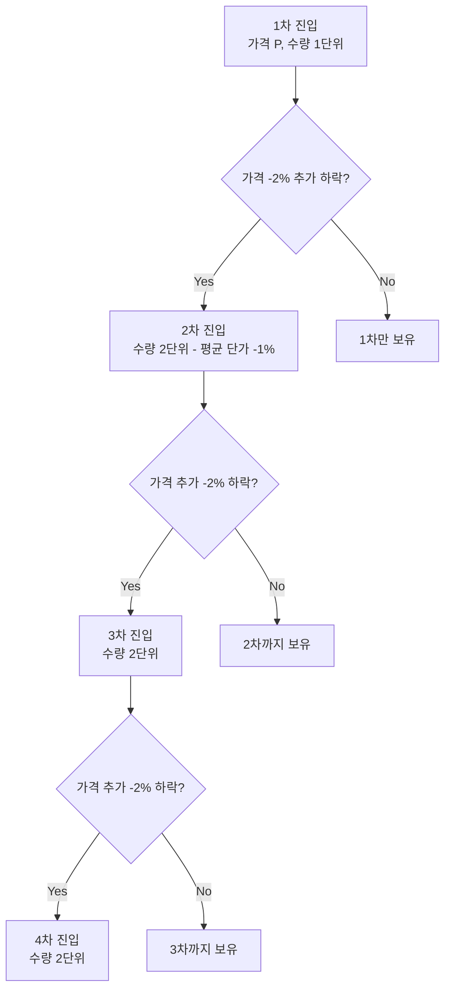
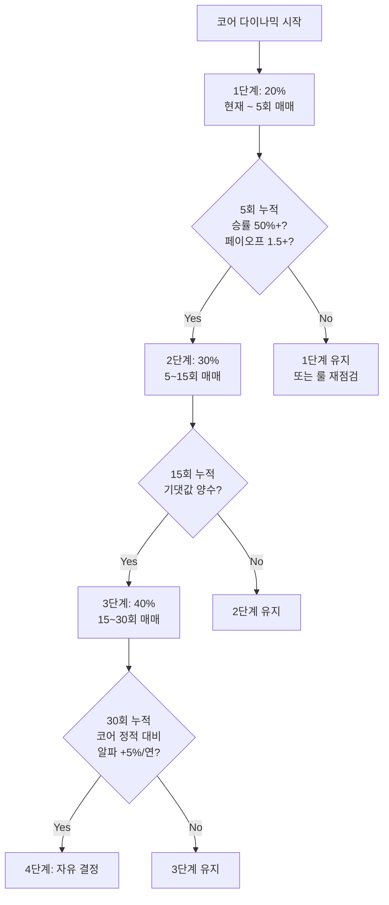

# 펀더멘털 스윙 매매 — 코어 다이나믹

> **박찬수의 강점 영역**: 펀더멘털 확신이 있는 종목에서 군중 심리 역행 매매를 통해 1~8주 단위로 수익을 추구하는 전략.

## 5줄 요약

1. 펀더멘털 스윙은 **순수 단기 트레이딩**과 **장기 보유** 사이의 제3 카테고리다.
2. 진입 조건: ① 펀더멘털 thesis 명확 + ② 군중 심리 역행 시점 + ③ 정량 신호 보조.
3. 보유 기간 1~8주, 분할 매수·매도 필수, 잔여 보유로 상방 옵션 유지.
4. 박찬수님의 SK하이닉스 사례가 첫 검증 데이터: 14 거래일 +21.2%.
5. 코어 다이나믹은 **20% → 40% 단계적 비중 확대** 권장 (검증 후 늘림).

---

## 1. 왜 "펀더멘털 스윙"이 필요한가

### 기존 분류의 한계

```
[기존 2분법]
- 코어 (장기 보유): NVDA, GOOGL — 매매 안 함
- 단기 트레이딩: VIX 기반 컨트래리언 — ETF 위주
```

이 분류로는 박찬수님 SK하이닉스 매매가 어디에도 안 맞는다:
- 코어로 분류하기엔 너무 능동적 (분할매수, 분할매도, 사이클 매매)
- 단기로 분류하기엔 펀더멘털 의존도가 너무 높음 (HBM/AI 인프라 thesis)

### 제3 카테고리 — 코어 다이나믹

```
[새 4분법]
- 코어 정적 (Static Core): NVDA, GOOGL — 거의 매매 없음
- 코어 다이나믹 (Trading Core): SK하이닉스, 삼성전자 — 펀더멘털+심리 매매
- 순단기 위성 (Speculative): VIX 기반 컨트래리언 ETF
- 현금 (Cash): 기회 대기
```

**코어 다이나믹의 정의**: 펀더멘털을 깊이 알고 있는 종목에서, 군중 심리에 의한 일시적 미스프라이싱을 활용하는 매매.

---

## 2. 펀더멘털 스윙 진입 3조건

3개 조건이 **동시에** 충족돼야 진입한다.

### 조건 1: 펀더멘털 thesis 명확

**한 문장으로 답해야 한다**: "이 회사가 왜 5년 후에도 더 가치 있는가?"

체크리스트:
- [ ] Secular trend 위에 있는가? (AI, 에너지 안보, 고령화 등)
- [ ] Moat이 강해지고 있는가? (1위 점유율, 기술 격차, 네트워크 효과)
- [ ] 실적 모멘텀이 회복/유지되는가? (분기 가이던스, 컨센서스 추세)
- [ ] 재무 안전성? (부채비율, 영업이익률, FCF)

**예: SK하이닉스**
- HBM 글로벌 1위, AI GPU 핵심 부품
- AI 인프라 capex 다년 확대 추세
- 메모리 사이클 회복 국면
- 시총 100조+, 재무 안정

### 조건 2: 군중 심리 역행 시점

**현재 가격 하락이 펀더멘털 약화 때문인가, 아니면 단기 노이즈 때문인가?**

군중 심리 신호:
- 단기 급락 (5 거래일 내 -10% 이상)
- 매크로 우려 헤드라인 (지정학, 금리, 경기 침체)
- 외국인 매도 폭주 (한국 시장)
- 신용 잔고 급감 (반대매매 발생)
- VKOSPI/VIX 급등

**핵심 질문**: "이 우려가 종목 펀더멘털에 직접 영향 주는가?"
- ✅ 직접 영향 → 매수 보류
- ❌ 간접/노이즈 → 매수 기회

**예: SK하이닉스 4/2 매수**
- 군중 심리: "전쟁 공포"
- 펀더멘털 영향: 직접적 영향 없음 (한국 본토 안전, AI 수요 지속)
- → **매수 기회**

### 조건 3: 정량 신호 보조

심리 신호를 정량으로 뒷받침:

| 지표 | 진입 신호 |
|------|----------|
| VKOSPI (한국) | > 25 |
| VIX (미국) | > 25 |
| 종목 RSI(14) | < 30 (과매도) |
| 외국인 누적 순매도 (5일) | 사상 평균 -1σ 이하 |
| 종목 -5거래일 누적 수익률 | < -10% |

3개 조건이 모두 충족되면 1차 진입.

---

## 3. 분할 매수 전략

### 4단계 피라미딩 다운



박찬수님 SK하이닉스 4/2 매수 분석:
- ₩873,000 × 1주
- ₩861,000 × 1주
- ₩856,000 × 2주
- ₩835,000 × 3주

→ 4단계 피라미딩 다운, 평균 단가 ₩856,143

### 사이징

```
1회 매수 한도 = 코어 다이나믹 자금의 30%
4단계 분할 시:
  1차: 5%
  2차: 7%
  3차: 8%
  4차: 10%
  합계: 30%
```

### 손절 라인

펀더멘털 스윙도 손절은 필요하다. 단 일반 단기 트레이딩과 다르다:

| 트리거 | 행동 |
|--------|------|
| 평균 단가 -15% | 1차 경고 — thesis 재점검 |
| 평균 단가 -20% | 2차 경고 — 50% 청산 |
| 평균 단가 -25% | 강제 청산 |
| **펀더멘털 thesis 깨짐** | **즉시 전량 청산** (예: HBM 점유율 1위 상실, 대규모 감산 발표) |

**중요**: 가격이 빠진다고 무조건 손절하지 않는다. **thesis 검증이 우선**.

---

## 4. 분할 매도 전략

### 3단계 분할 익절

```
+10% 도달: 1/3 매도 (이익 일부 확보)
+20% 도달: 1/3 매도 (=총 2/3 청산)
+30% 도달: 잔여 1/3 매도

또는 박찬수님 패턴:
+15~20% 도달: 6/7 매도 (대부분 청산)
+30~40% 도달: 잔여 1/7 매도 (옵션 노출 유지)
```

### 잔여 보유의 가치

전부 청산 vs 일부 잔여 보유의 차이:

```
시나리오 1: 전량 청산 @ +20%
  수익: 7주 × +20% = +140%주

시나리오 2: 6주 청산 @ +20%, 1주 잔여 → +35% 청산
  수익: 6주 × +20% + 1주 × +35% = +120% + +35% = +155%주

→ 잔여 1주 보유가 +15%주 추가 수익 (단, 잔여가 빠질 위험도 동시 보유)
```

비대칭성: 잔여 1주의 상승 노출은 평균 단가 회복에 큰 영향. 잃어도 작음(1주만큼).

### 시간 청산

- 진입 후 30 거래일 경과 시 강제 청산 (펀더멘털 스윙은 코어 다이나믹이지 무한 보유 아님)
- 단, **펀더멘털 thesis가 강화되면 코어 정적으로 이동 가능** (예: HBM 점유율 더 늘어남 → 장기 보유 결정)

---

## 5. 코어 정적과 코어 다이나믹의 분리 원칙

### 같은 종목을 둘 다 보유 가능?

**원칙적으로는 분리 권장**. 다만 박찬수님 NVDA처럼 코어 정적으로 이미 보유 중인 종목을, 큰 공포 시점에 추가 매수하는 경우는 **코어 정적의 추가매수**로 분류 (코어 다이나믹 아님).

명확히 분리할 종목:
- 코어 정적: NVDA, GOOGL, LRCX 등 (장기 무기한 보유)
- 코어 다이나믹: SK하이닉스, 삼성전자, 한미반도체 등 (스윙 매매 전용)

### 자금 분리

각 카테고리의 매수가/평균단가/매도가는 **별도 회계** 처리:

```
NVDA 보유 (코어 정적): 26주, 평균 ₩249,032
- 이 종목으로는 절대 단기 매매 안 함
- 추가 매수 시에도 코어 정적 평균 단가만 갱신

SK하이닉스 (코어 다이나믹): 매매 시마다 새 사이클로 기록
- 1차 사이클 / 2차 사이클 / 3차 사이클...
- 각 사이클의 진입가/청산가/수익률 별도 관리
```

### 심리 분리

- 코어 정적: -30% 빠져도 흔들리지 않음 (thesis 살아있는 한)
- 코어 다이나믹: -15%에서 thesis 재점검, -25%에서 강제 손절
- **두 마인드를 섞으면 둘 다 망가짐**

---

## 6. 박찬수님 코어 다이나믹 종목 풀 (제안)

### 1차 풀: 강점 영역 (메모리/AI 반도체)

| 종목 | 코드 | 펀더멘털 핵심 | 군중 심리 트리거 |
|------|------|-------------|----------------|
| **SK하이닉스** | 000660 | HBM 1위, AI 인프라 | 메모리 사이클 우려, 지정학 |
| 삼성전자 | 005930 | 메모리+파운드리 | 외국인 매도, 환율 |
| 한미반도체 | 042700 | HBM 본더, 직접 노출 | HBM 가격 우려, 경쟁 우려 |
| 원익머트리얼즈 | 104830 | 특수가스 | 반도체 전반 우려 |

### 2차 풀: 변동성 큰 펀더멘털 종목

| 종목 | 코드 | 펀더멘털 핵심 |
|------|------|-------------|
| 크래프톤 | 259960 | 게임, 변동성 큼 |
| 데브시스터즈 | 194480 | 게임, 박찬수님 매매 경험 있음 |
| NAVER | 035420 | 플랫폼, AI 도입 |

### 3차 풀: 검증 후 추가 가능

- 2차전지: LG에너지솔루션, 에코프로비엠
- 자동차: 현대차, 기아
- 바이오: 셀트리온, 삼성바이오로직스 (펀더멘털 분석 후)

**원칙**: 풀에 들어가려면 박찬수님이 **30초 안에 펀더멘털을 설명할 수 있어야 한다.** 모르는 종목은 풀에서 제외.

---

## 7. 단계적 비중 확대 룰



### 검증 지표 정의

- **승률**: 수익으로 끝난 매매 비율 (목표 ≥ 50%)
- **페이오프**: 평균 수익 / 평균 손실 (목표 ≥ 1.5)
- **기댓값**: 승률 × 평균수익 - 패율 × 평균손실 (목표 > 0)
- **알파 (코어 정적 대비)**: 코어 다이나믹 연수익률 - 코어 정적 평균 보유 수익률

### 후행 점검

매분기말 누적 매매 통계로 다음 분기 비중 결정. 도중에 비중 즉흥 확대 금지.

---

## 8. 박찬수님 SK하이닉스 사례 — 1번 데이터 포인트

거래내역에서 발견된 사례:

```
[2차 사이클]
- 진입 (4/2): 7주 × ₩856,143 = ₩5,993,000
- 청산 1차 (4/8): 6주 × ₩1,020,000 = ₩6,120,000 (+19.2%)
- 청산 2차 (4/16): 1주 × ₩1,154,000 (+34.8%)
- 보유 기간: 14 거래일
- 순수익: ₩1,267,907
- 수익률: +21.2%
```

### 평가

✅ **잘한 점**:
- 펀더멘털 + 심리 결합 매매
- 4단계 분할 매수
- 잔여 보유로 상방 노출
- 자금 흐름 설계 (4/1 매도 → 4/2 매수)

⚠️ **개선할 점**:
- 1R 룰 위반 (베팅 한도 초과)
- 사전 thesis 박제 부재 (사후 재구성)
- 청산 비율 사전 미명시

### 의의

이 1건은 **데이터 포인트 1/30**. 다음 4건이 비슷한 패턴이면 박찬수님 시스템이 검증됨. 확정은 30회 누적 후.

---

## 9. 다음 행동 항목

### 즉시

1. **종목 풀 사전 카드 작성**: SK하이닉스, 삼성전자, 한미반도체, 원익머트리얼즈 (4개)
2. **각 종목의 펀더멘털 thesis 한 페이지로 정리** → `01-Watchlist/KR/`
3. **다음 매매 시 사전 thesis 박제 의무화** → `Templates/tpl-매매일지-단기.md` 사용

### 단기 (1~3개월)

1. **5회 매매 누적** → 1차 통계 검토
2. **종목별 패턴 분석** (어떤 종목에서 승률 높은가)
3. **시간대별 / 트리거별 패턴 추적**

### 중기 (3~12개월)

1. **15~30회 매매 누적** → 시스템 검증 완료
2. **비중 확대 결정** (1단계 → 2단계 → 3단계)
3. **시스템 수정** (룰 보완, 종목 풀 갱신)

---

## 관련 노트

- 학습 자료 인덱스: [[_MOC]]
- 종목 풀 선정: [[02-종목-풀-선정]]
- 포지션 사이징: [[03-포지션-사이징]]
- 매매일지 시스템: [[04-매매일지-시스템]]
- SK하이닉스 사례: [[2026-04-02-매수-SK하이닉스]]

---

## 참고 자료

- William O'Neil, *How to Make Money in Stocks* (1988) — CAN SLIM, 펀더멘털+기술적 결합
- Jesse Livermore, *Reminiscences of a Stock Operator* (1923) — 펀더멘털 인식 + 시장 심리
- Stan Weinstein, *Secrets for Profiting in Bull and Bear Markets* (1988) — 4단계 사이클 분석
- Michael Mauboussin, *More Than You Know* (2006) — 인지 편향과 시장 심리
