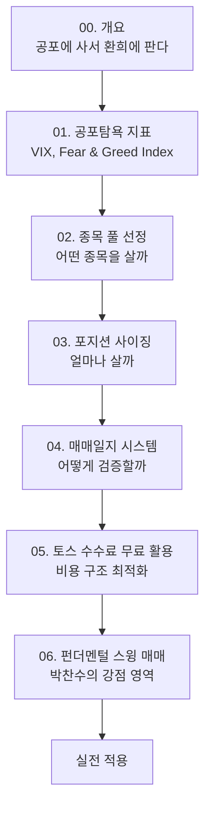
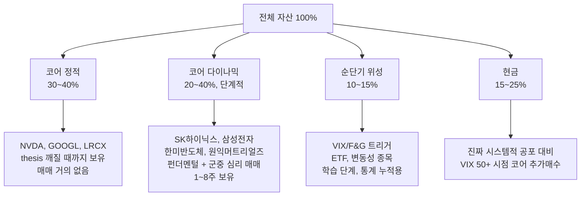

# 단기 트레이딩 학습 인덱스

> "공포에 사서 환희에 판다" — 군중과 반대로 가는 심리·유동성 기반 트레이딩 시스템을 구축하기 위한 학습 자료입니다.

## 학습 순서

## 자료 목록

| 번호 | 주제 | 핵심 질문 |
|------|------|-----------|
| [[00-개요-공포에-사서-환희에-판다]] | 컨트래리언 투자 철학 | 군중과 반대로 가는 게 왜 통하는가? |
| [[01-공포탐욕-지표-정량화]] | VIX, Fear & Greed Index, AAII | 공포·환희를 어떻게 숫자로 잡는가? |
| [[02-종목-풀-선정]] | 단기 트레이딩 적합 종목의 조건 | 어떤 종목이 "유동성 기회"를 만드는가? |
| [[03-포지션-사이징]] | 켈리 공식, 1R 룰 | 한 번에 얼마를 베팅해야 하는가? |
| [[04-매매일지-시스템]] | 매매 후 복기 프레임워크 | 운인지 실력인지 어떻게 분리하는가? |
| [[05-토스-수수료-무료-활용]] | 비용 구조 분석 | 수수료 무료를 어떻게 극대화하나? |
| [[06-펀더멘털-스윙-매매]] | **코어 다이나믹 영역** | 펀더멘털 + 군중 심리를 어떻게 결합하나? |
| [[07-second-level-thinking-NVDA-사례]] | **박찬수의 알파 정의** | 컨센서스 정반대 결론을 어떻게 도출하는가? (NVDA DeepSeek 진입 사례) |

## 박찬수의 트레이딩 4룰

1. **진입 트리거 정량화** — 펀더멘털 thesis + VIX/F&G/RSI 등 정량 지표 결합
2. **종목 사전 선정** — 미리 정해놓은 풀에서만 매매 (즉흥 매매 금지)
3. **베팅 한도** — 1회 트레이드 = 해당 자금 카테고리의 30% 이내, 1R 룰 준수
4. **매매일지 의무화** — 진입 직후 thesis 박제, 1주일 후 복기

## 자산 구조 (4분할)

## 코어 다이나믹 단계적 비중 확대

| 단계 | 매매 누적 | 검증 조건 | 코어 다이나믹 비중 |
|------|-----------|----------|------------------|
| 1단계 | 0~5회 | — | 20% |
| 2단계 | 5~15회 | 승률 ≥ 50%, 페이오프 ≥ 1.5 | 30% |
| 3단계 | 15~30회 | 기댓값 > 0 | 40% |
| 4단계 | 30회+ | 알파 +5%/연 | 자유 결정 |

## 매매 통계 (누적 2/30)

| 회차 | 종목 | 진입일 | 청산일 | 보유일 | 수익률 | 비고 |
|------|------|--------|--------|--------|--------|------|
| 1 (사이클 #1) | SK하이닉스 | 2026-04-01~02 | 2026-04-03 | 3거래일 | +3.62% | 단타 |
| 2 (사이클 #2) | SK하이닉스 | 2026-04-06 | 2026-04-10~20 | 14거래일 | **+22.04%** | 펀더멘털 스윙 |

## 관련 노트

- 정체성 정의: `CLAUDE.md` 0번 섹션
- 매매일지: `04-Trading-Journal/`
- 정기 복기: `04-Trading-Journal/{YYYY}-{Q}-복기.md`
- 첫 사례 매매일지 (날짜 정정):
  - [[2026-04-01-매수-SK하이닉스]] (사이클 #1 진입 1차)
  - [[2026-04-02-매수-SK하이닉스]] (사이클 #1 진입 2차)
  - [[2026-04-03-매도-SK하이닉스]] (사이클 #1 종료, +3.62%)
  - [[2026-04-06-매수-SK하이닉스]] (사이클 #2 진입)
  - [[2026-04-10-매도-SK하이닉스]] (사이클 #2 1차 익절)
  - [[2026-04-20-매도-SK하이닉스]] (사이클 #2 잔여 익절)
- 5년 거래내역 회고: [[2026-04-26-5년-거래내역-피드백]]
- 단기 매매일지 템플릿: `Templates/tpl-매매일지-단기.md`
